# 一、空间向量

## 1. 平面与空间直线

 	### 	1. 平面与直线的方程

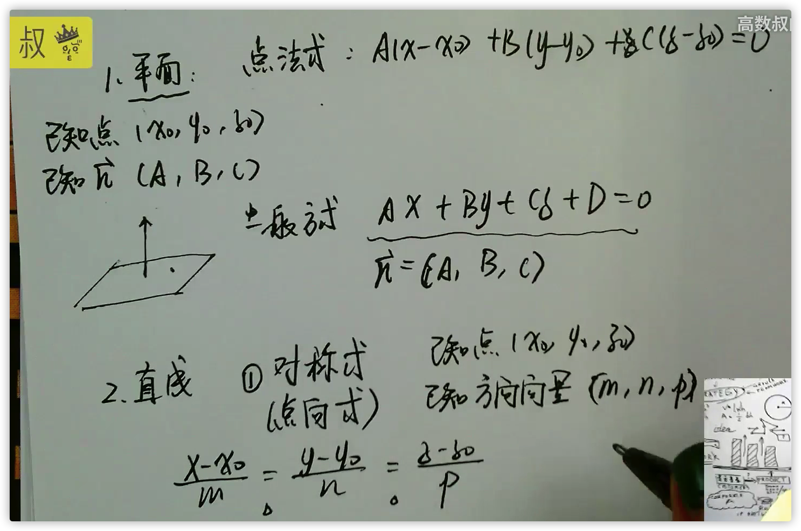

### 	2. 矩阵求两平面相交的方向向量

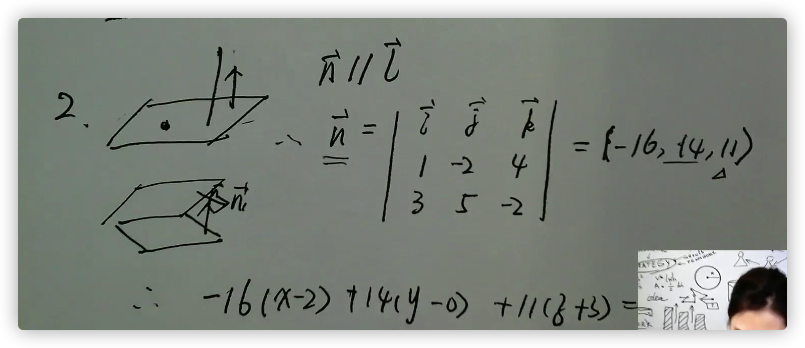

# 二、二元函数求极限

### 1. 分母不为0，函数连续，直接代入

### 2. 分母为0，分子有理化

### 3. 变量代换，令xy=t，将二元函数转化为一元函数

### 4. 等价无穷小替换，如tan(xy) --> xy

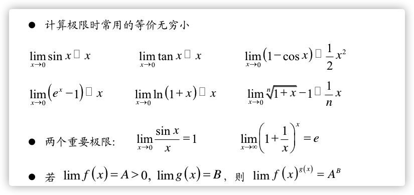

# 三、偏导数

### ==附：基本求导公式==

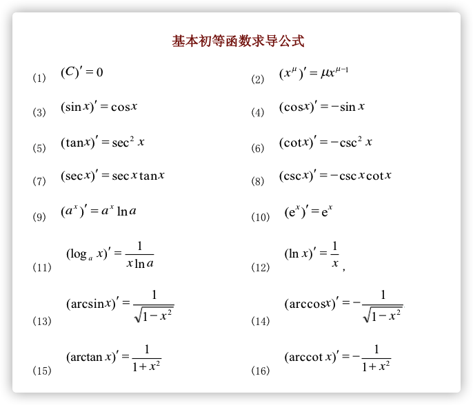

### 1. 直接将另一个变量当作常数求偏导

### 2. 底数和指数都在变化，化作以e为底（或者幂函数求导）

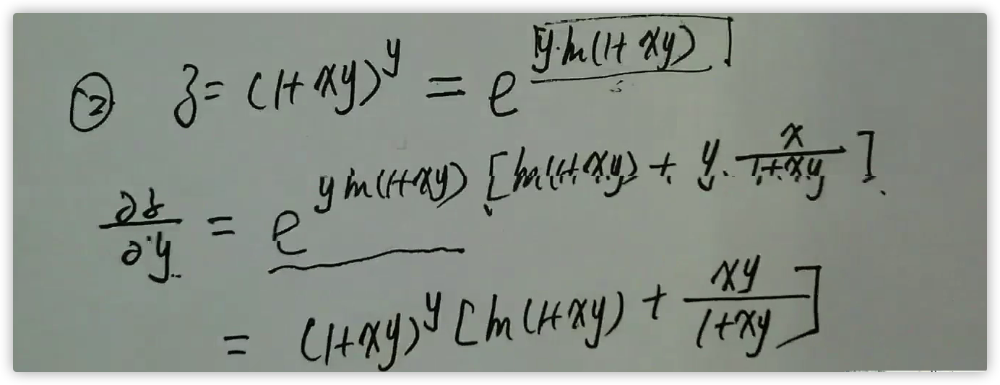

### 3. 求偏导数在某点的值

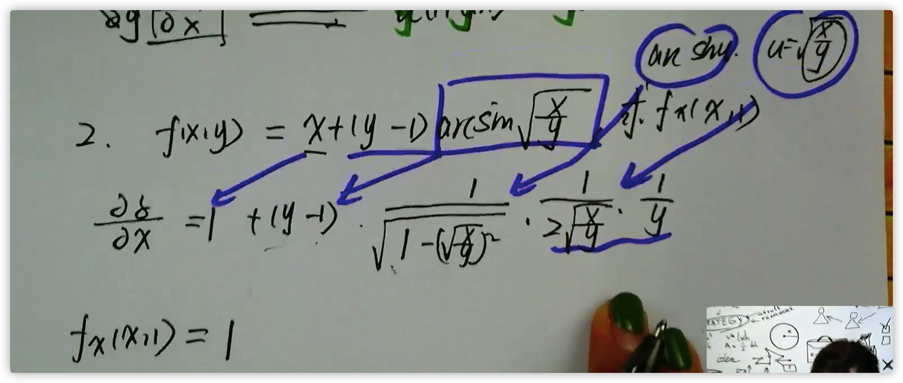

### 4. 高阶偏导数

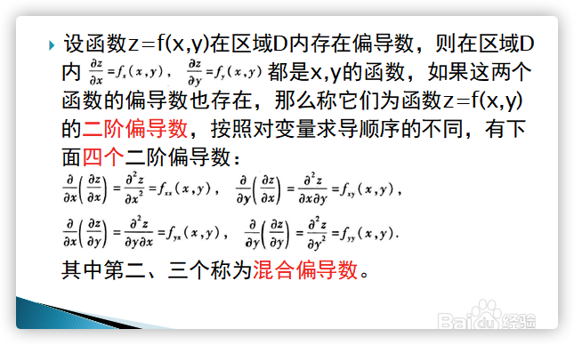

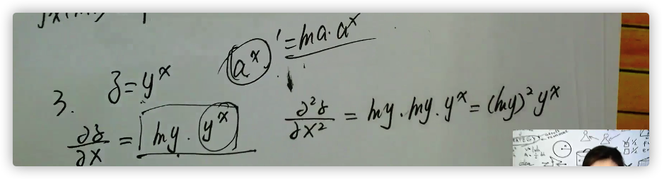

# 四、全微分

### 一、定义

### 2. 推导关系

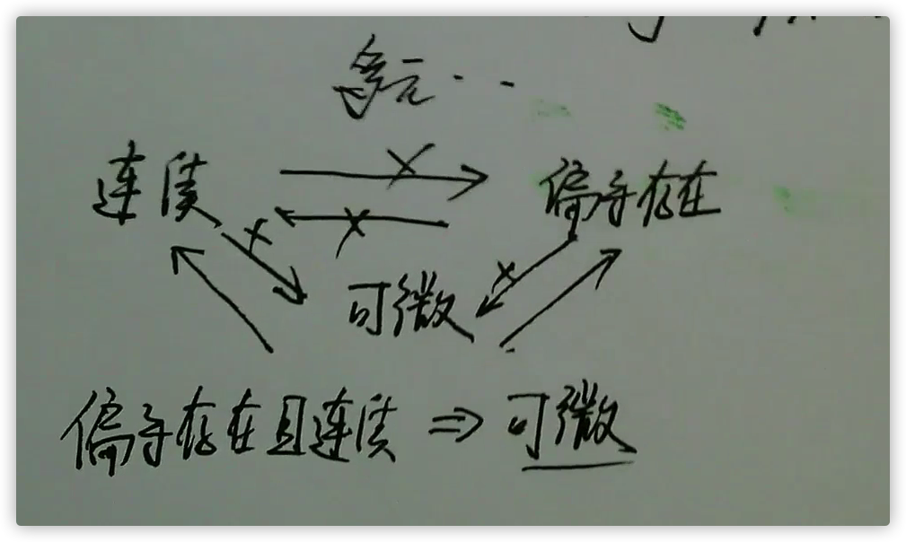

### 3. 单个变量求导数，多个变量求偏导

### 4. 有几个中间变量就有几项，有几个自变量就有个偏导数

### 5. 抽象函数求偏导

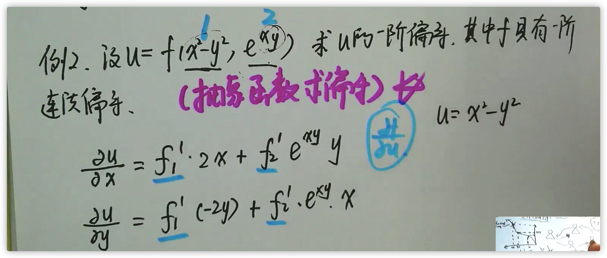

### 5. 二阶偏导数及抽象函数求二阶偏导

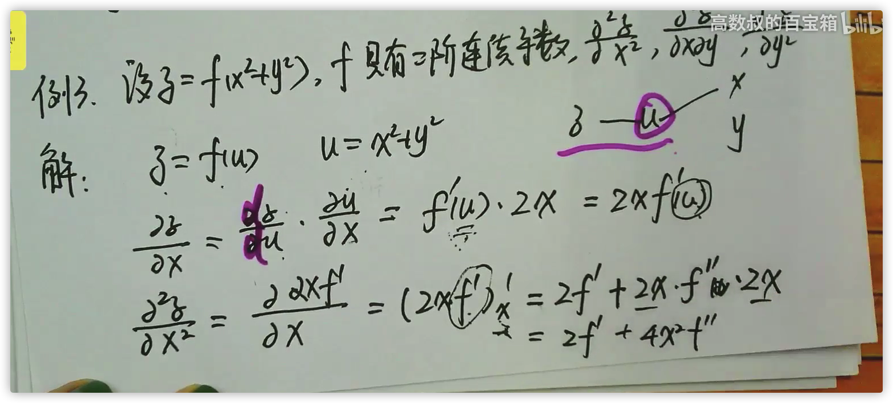

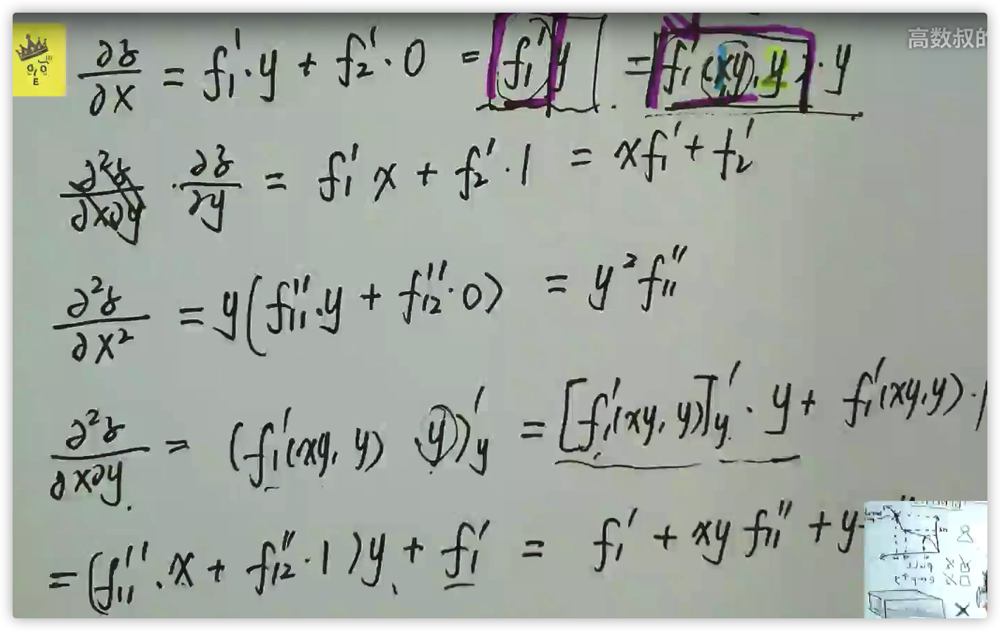

### 6. 二阶连续导数

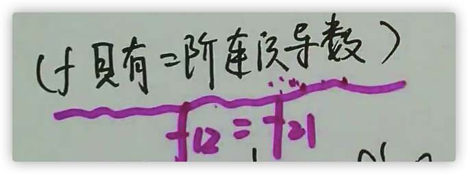

### 7. 隐函数求导

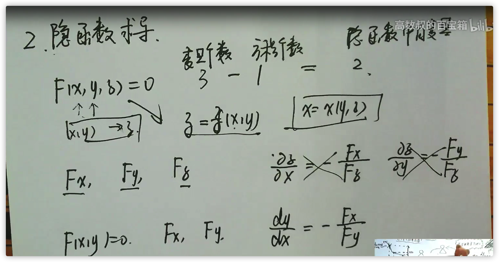

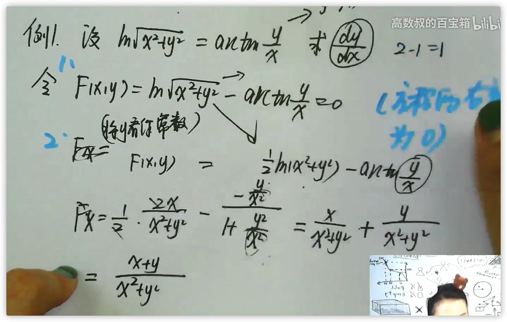

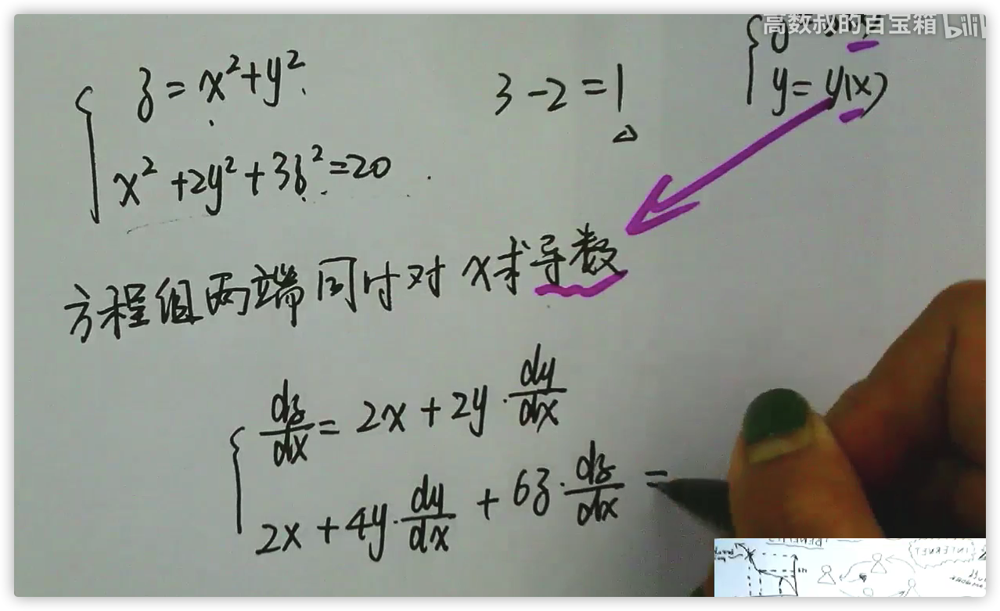

# 五、多元函数微分学几何应用

### 1. 曲面的切平面和法线

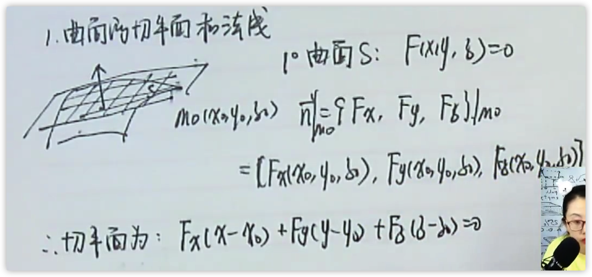

### 2. 曲线的切线和法平面

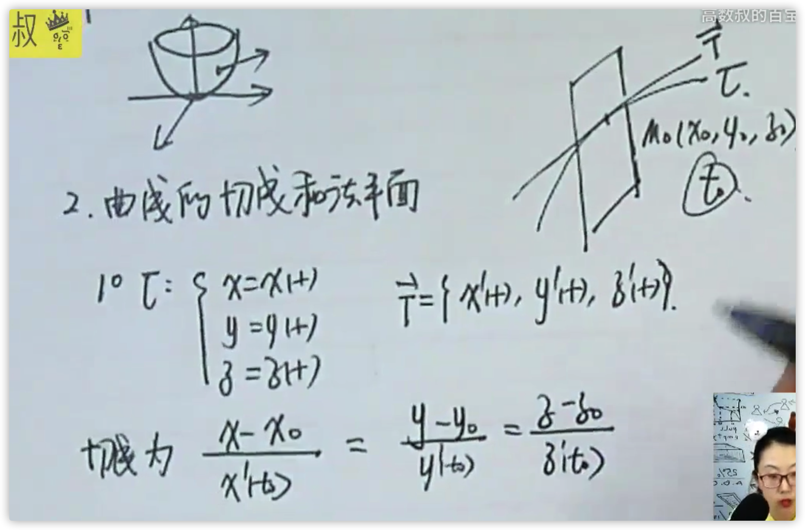

